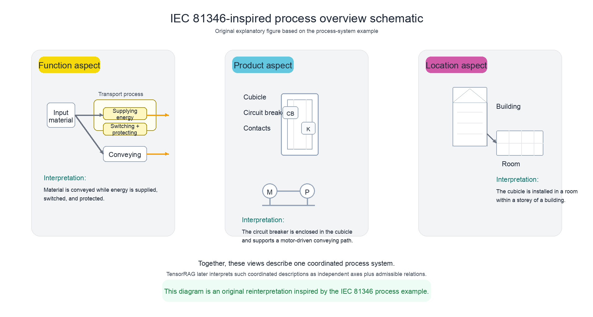
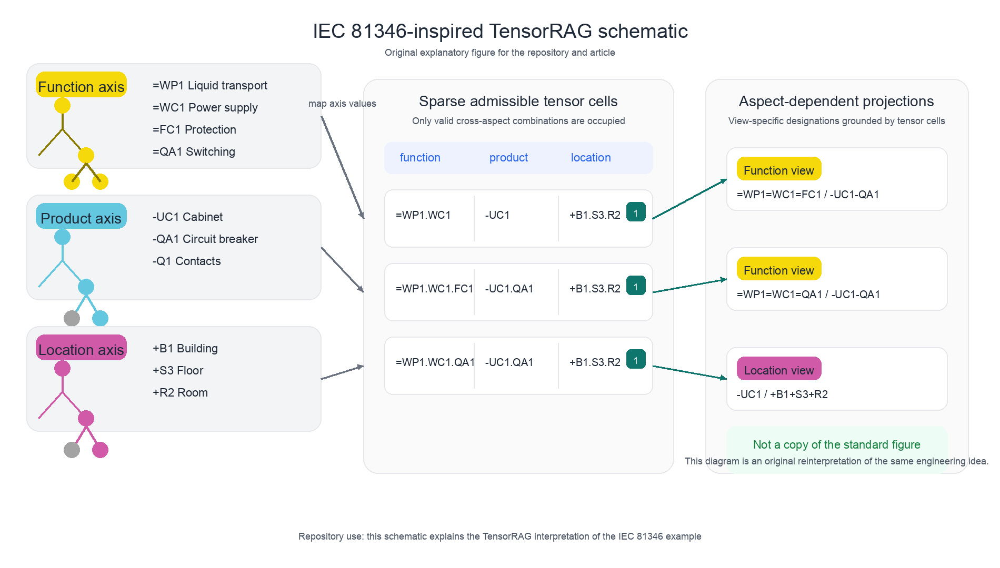

# TensorRAG

TensorRAG is a research prototype for retrieval-augmented generation in which knowledge is organized both as text chunks and as a sparse tensor of orthogonal aspects.

This repository accompanies the TensorRAG manuscript. An arXiv link will be added here after the preprint is public.

License: [Apache-2.0](LICENSE).

## Quick Start

```bash
git clone https://github.com/otugayev/tensorrag.git
cd tensorrag
pip install -e .
cp .env.example .env
```

Put your `OPENAI_API_KEY` into `.env`, then run:

```bash
tensorrag build
tensorrag ask --query "where is the cabinet located?"
```

## What the Repo Contains

- `axes`: tree-structured aspect hierarchies
- `tensor`: sparse admissible cross-axis cells
- `text`: grounded text facts
- `embeddings`: semantic ranking after structural filtering

In the current prototype, the tensor is not stored as a dense multidimensional array. It is stored as a sparse admissible subset such as `T ⊆ F × P × L`.

## IEC 81346 Example

The main public example in this repository is an IEC 81346-inspired function/product/location setup. It is useful because many readers already know this style of aspect-oriented engineering description.

The first original explanatory schematic is inspired by the process-system overview example:



The second original explanatory schematic shows the TensorRAG interpretation of the aspect-coordination idea:



Both diagrams are original explanatory schematics for the repository rather than reproductions of standard figures.

Relevant files:

- [`input/iec81346_example.json`](input/iec81346_example.json): the single public executable example in this repository

## CLI

Two commands are supported:

- `tensorrag build --input <json>`: build the cache for an input file
- `tensorrag ask --input <json> --query "<question>"`: query a built cache

Useful options:

- `--input`: input JSON file; `input/` is searched automatically
- `--cache`: optional cache path; otherwise a default cache name is derived from the input file
- `--query`: required for `ask`
- `--top-k`: optional number of retrieved chunks for `ask`; default is `5`
- `--debug`: optional verbose structural output

## Try These Questions

Start with the strict example:

```bash
tensorrag build
tensorrag ask --query "where is the cabinet located?"
tensorrag ask --query "what does the circuit breaker do?"
tensorrag ask --query "what performs switching?"
tensorrag ask --query "which product implements protection?"
tensorrag ask --query "which component in the room performs protection?"
tensorrag ask --query "what product is associated with the power supply function?"
```

A good workflow is:

1. Run the example questions as they are.
2. Change one word at a time.
3. Re-run `tensorrag ask` with modified wording.

## Input Format

The public input format is JSON with four top-level sections:

- `axis_meta`: axis roles and aliases
- `axes`: explicit node names and parent links
- `tensor`: sparse admissible cross-axis cells
- `text`: text facts used for grounding and retrieval

See [`input/iec81346_example.json`](input/iec81346_example.json) for the public example used in this repository.

## Use Your Own JSON

You are not limited to the IEC example. TensorRAG can build and query any JSON file that follows the same top-level structure:

```json
{
  "axis_meta": {},
  "axes": {},
  "tensor": [],
  "text": []
}
```

Build and query your own file like this:

```bash
tensorrag build --input /path/to/my_example.json
tensorrag ask --input /path/to/my_example.json --query "your question here"
```

If your file is placed inside `input/`, a relative path is enough:

```bash
tensorrag build --input input/my_example.json
tensorrag ask --input input/my_example.json --query "your question here"
```

## Current Scope

What the current code already demonstrates:

- fixed aspect axes such as `function`, `product`, and `location`
- explicit admissible cross-axis combinations via a sparse tensor
- grounding text chunks to axis nodes and tensor cells
- retrieval constrained by structure first and ranked by embeddings second

What it does not yet implement as first-class runtime objects:

- general variable-arity records over arbitrary aspect subsets
- explicit versus inferred assignment labels in returned results
- first-class provenance objects for every retrieved assignment
- structured missing-aspect outputs

## Repository Layout

```text
tensorrag/     Python package
input/         example input files
docs/images/   README figures
cache/         generated tensor cache files
```

## Notes

- Python 3.11+ is required.
- `cache/*.tensor_cache.json` files are generated artifacts and should not be committed.
- This repository is a focused companion implementation of the TensorRAG retrieval core, not a complete implementation of every architectural claim in the manuscript.
